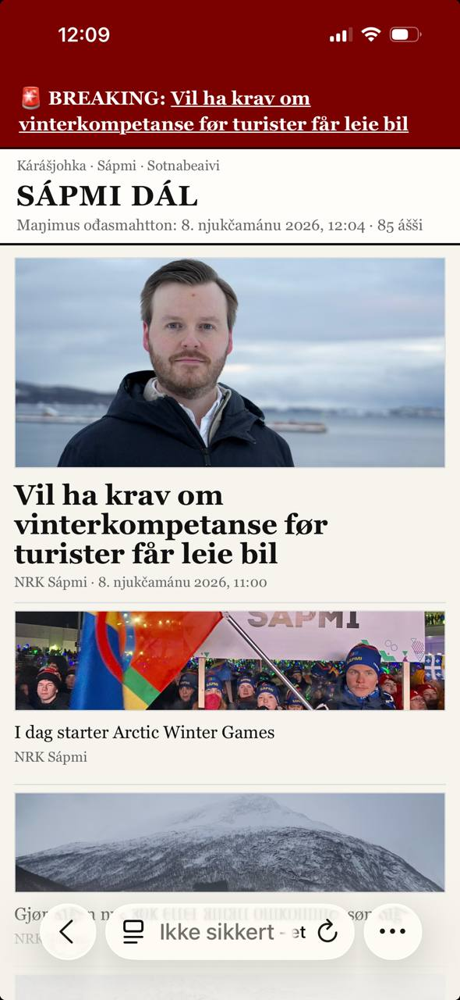

# Sápmi dál

Lokal, lettvekts nyhetsfront for samiske/Sápmi-relaterte kilder.

## Skjermbilder

### Desktop


### Mobil



## Hva den gjør

- Henter RSS/Atom fra:
  - NRK Sápmi
  - Yle Sápmi
  - SVT Norrbotten
  - Ávvir
  - Ságat
- Finner bilder fra feed + fallback fra artikkelside (`og:image`) for kilder som mangler bilder i feed.
- Bygger en enkel avisforside med:
  - toppsak
  - hurtigsaker
  - geografiske seksjoner: **Norga**, **Ruoŧŧa**, **Suopma**, **Ruošša**
- UI-tekst på nordsamisk.

## Krav

- Python 3.9+

## Hurtigstart (uten Docker)

```bash
git clone <repo-url>
cd sapmi-dal

# Oppdater datagrunnlag
python3 update_sapmi_news_board.py

# Start lokal webserver
./start_server.sh
```

Åpne deretter: `http://127.0.0.1:8787`

## Hurtigstart (Docker Compose)

Krever Docker Desktop (eller Docker Engine + Compose plugin).

```bash
git clone <repo-url>
cd sapmi-dal

docker compose up -d --build
```

Dette gjør:
- starter webserver på port `8787`
- oppdaterer nyhetsdata automatisk hvert 5. minutt i containeren

Åpne: `http://127.0.0.1:8787`

Stoppe:

```bash
docker compose down
```

## Mapper

- `web/` – statisk nettside (HTML/CSS/JS)
- `web/data/news.json` – generert nyhetsdata
- `update_sapmi_news_board.py` – innhenting + transformering
- `start_server.sh` – enkel lokal server (port 8787)

## Produksjonsnotat

For stabil drift anbefales scheduler hvert 5. minutt:

```bash
python3 update_sapmi_news_board.py
```

Siden refresher data automatisk i nettleseren hvert 60. sekund.

## Lisens

MIT
